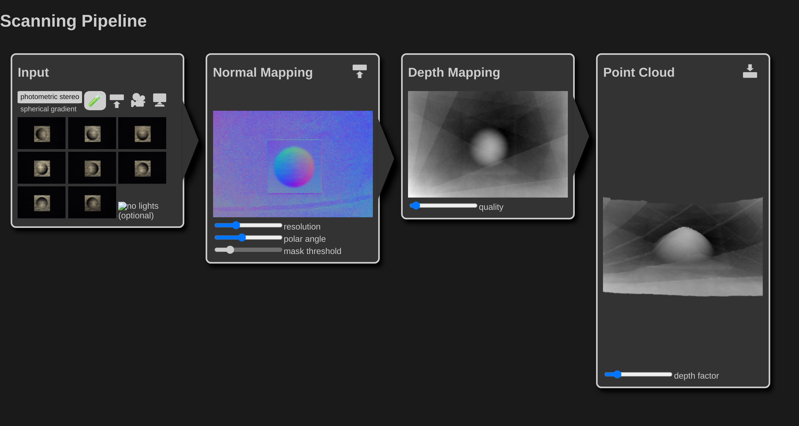

# Scanning Pipeline

[](https://app.netlify.com/sites/scanning-pipeline/deploys)

## Live Demo in Web Browser

[](https://yertleturtlegit.github.io/scanning-pipeline/)
[https://yertleturtlegit.github.io/scanning-pipeline/](https://yertleturtlegit.github.io/scanning-pipeline/)

## Run and Edit on Local Maschine

1. Clone the repository:

   ```bash
   git clone https://github.com/YertleTurtleGit/scanning-pipeline
   ```

2. Open your preferred web browser and open the
   ['index.html'](index.html) file.

   _Chromium based browsers work best. File access from files needs to be enabled:_

   ```bash
   chromium --allow-file-access-from-files index.html
   ```

3. You can now edit the files with your preferred Editor
   and refresh the web browser to see the results.

## Recommendations

1. Use [Visual Studio Code](https://code.visualstudio.com/) and open the [workspace file](scanning-pipeline.code-workspace).

   Now you can run the application by using the configuration in [launch.json](.vscode/launch.json).
   
   _In Visual Studio Code: 'Run > Start Debugging (F5)'_

2. Use [jsdoc](https://www.npmjs.com/package/jsdoc).

   ```bash
   npm install jsdoc
   ```

3. Install npm types for [three.js](https://www.npmjs.com/package/@types/three) and [chart.js](https://www.npmjs.com/package/@types/chart.js).
   ```bash
   npm install @types/three
   npm install @types/chart.js
   ```
