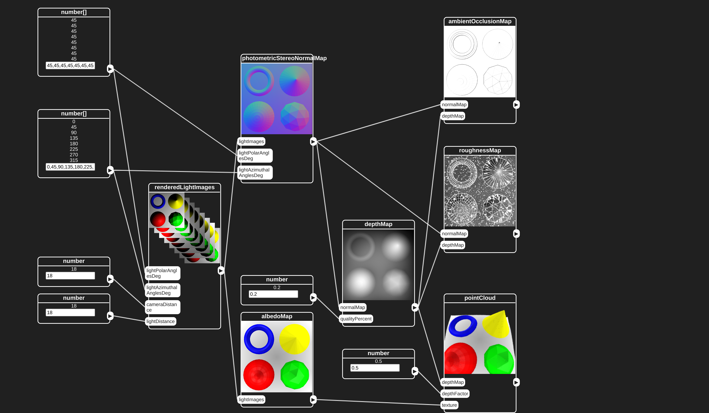

# Scanning Pipeline

## Live Demo in Web Browser

[](https://yertleturtlegit.github.io/scanning-pipeline/)
[https://yertleturtlegit.github.io/scanning-pipeline/](https://yertleturtlegit.github.io/scanning-pipeline/)

## Run and Edit on Local Maschine

1. Clone the repository:

   ```bash
   git clone https://github.com/YertleTurtleGit/scanning-pipeline
   ```

2. Open your preferred web browser and open the
   ['index.html'](index.html) file.
   
3. You can now edit the files with your preferred Editor
   and refresh the web browser to see the results.

## Recommendations

1. Use Visual Studio Code.

2. Install npm types for three.js and chart.js.

3. Use jsdoc. 
